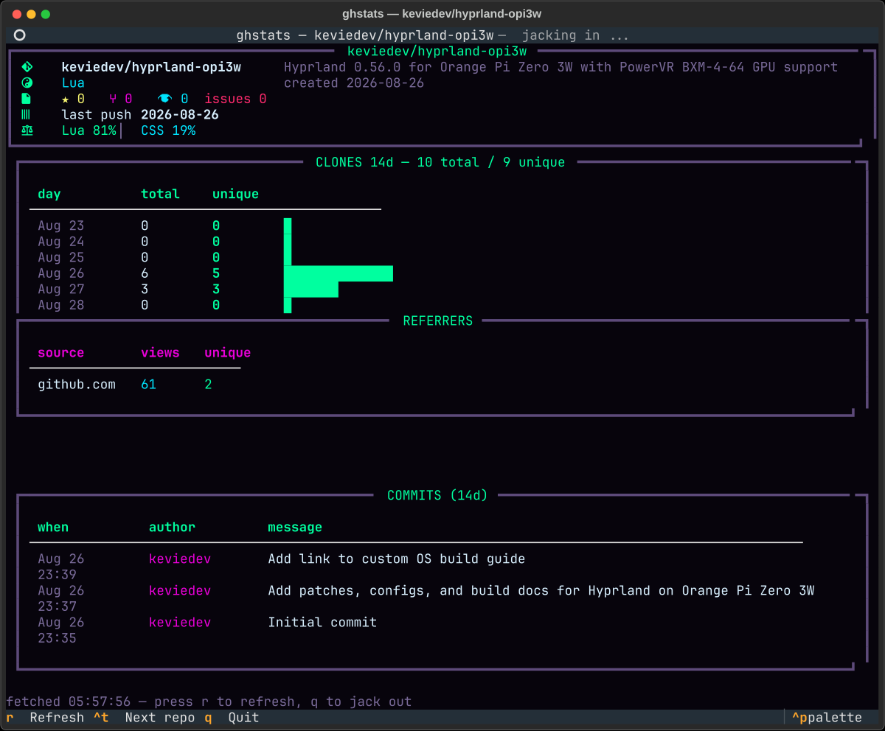

# ghstats — a neon GitHub dashboard for your terminal

A [Textual](https://textual.textualize.io)-powered TUI that surfaces GitHub
repo traffic the web UI buries behind graphs menus: clones, views, referrers,
top paths — plus stars/forks/watchers, language breakdown, and recent
commits, all in one screen.

Styled in the **neo-glitch** palette: RGB-split neon on void black.



## Features

- **Hero panel** — description, stars / forks / watchers / issues,
  language mix, last push
- **Clones & views (14 days)** — daily totals and unique counts with
  neon bar sparklines
- **Referrers & top paths** — where your traffic comes from
- **Recent commits** — last 14 days with authors and timestamps
- **`Ctrl+T`** — cycle through every repo you have push access to
- **`r`** — refresh (auto-refreshes every 5 minutes anyway)
- **`q`** — quit

## Requirements

- Python 3.11+ with [Textual](https://pypi.org/project/textual/)
- The [`gh`](https://cli.github.com) CLI, logged in (`gh auth login`)

No tokens, no OAuth apps, no stored credentials — every API call is
delegated to `gh`, which manages its own keyring auth.

## Install

```bash
git clone https://github.com/keviedev/ghstats.git
cd ghstats
pip install --user textual

# run straight from the repo, or install a launcher:
ln -s "$PWD/ghstats.py" ~/.local/bin/ghstats
```

Optionally, add a keybind in Omarchy/Hyprland:

```lua
o.bind("SUPER + G", "ghstats", { terminal = "ghstats" })
```

## Palette

| Token | Hex |
| --- | --- |
| void | `#07040c` |
| green | `#00ff9f` |
| cyan | `#00e5ff` |
| magenta | `#ea00d9` |
| red | `#ff2a6d` |
| yellow | `#f9f871` |

Matches the [neo-glitch Omarchy theme](https://github.com/keviedev/omarchy-neo-glitch).

## License

MIT